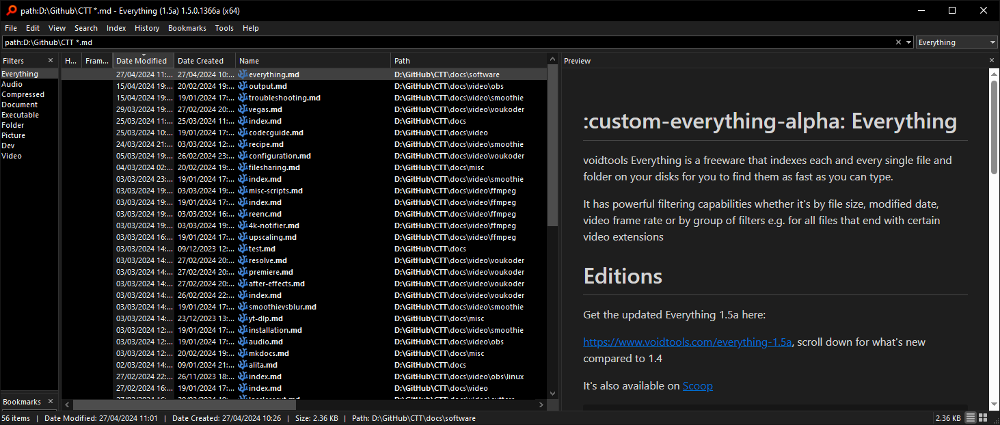

# :custom-everything-alpha: Everything

voidtools Everything is a freeware that indexes each and every single file and folder on your disks for you to find them as fast as you can type.

It has powerful filtering capabilities whether it's by file size, modified date, video frame rate or by group of filters e.g. for all files that have video extensions



# Installation

Get the updated Everything 1.5a here:

<https://www.voidtools.com/everything-1.5a>

(scroll down for what's new compared to 1.4)

It's also available on [Scoop](https://github.com/ScoopInstaller/Versions/blob/master/bucket/everything-alpha.json)

```PowerShell
scoop.cmd bucket add versions
scoop install versions/everything-alpha
```

And [winget](https://github.com/microsoft/winget-pkgs/tree/master/manifests/v/voidtools/Everything/Alpha):

```PowerShell
winget install -e --id voidtools.Everything.Alpha
```

For Linux users, check out [FSearch](https://alternativeto.net/software/fsearch/about) as an alternative

## Search examples

All of the minecraft screenshots you took this century:
```
20??-??-??_??.??.??.png
```

All MP4 videos in a certain folder (recursive)
```
path:D:/Vids *.mp4
```

`*` is a wildcard pattern for any characters, `*.mp4` means all files that end in .mp4

`?` is a wilcard for a single character, e.g. `?.png` means any png file that has a name with one character e.g. `a.png`

With enough practice you can find anything on your system without effort

See <https://www.voidtools.com/support/everything/searching> for more reference

## Setting up the UI

Having to manually open up a third party app each time you want to search is not convenient, 

1. You can set a shortcut in `Tools -> Options... (CTRL+P)` in the `General -> Keyboard` named `Toggle Window Hotkey`, I've been using <kbd>CTRL+SHIFT+E</kbd> for years, it really turns Everything from gimmicky to a must-have.

2. Using `ALT+P` lets you toggle preview of the file you have selected

3. In `View` you can enable `Filters` which show a list of file types (e.g. image, audio, video, documents) which essentially are search presets, just like files you can select multiple of them when holding <kbd>CTRL</kbd>

    I made my own called `Dev` which has search value `ext:ps1;cmd;rs;json;js` for to capture all of the files I use within git repositories

4. You can have extra sorting options by adding more columns, just right clicking any of them: 

    