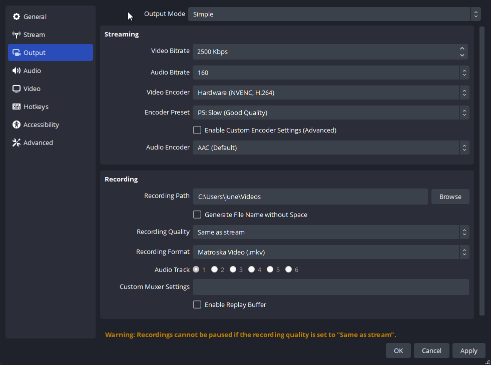

# :simple-obsstudio: OBS 

## Introduction
[Open Broadcaster Software (OBS)](https://obsproject.com/) is a free and open-source software for live streaming and recording. Here you'll learn how to configure OBS for all your needs.

## Installing OBS
You can download OBS from the official [downloads page](https://obsproject.com/download). This page provides multiple sources from which you can install it.

If you're using any package managers like WinGet, Scoop, or Chocolatey, you can install OBS with the following commands:

* For WinGet: `winget install -e --id OBSProject.OBSStudio`
* For Scoop: `scoop bucket add extras; scoop install extras/obs-studio`
* For Chocolatey: `choco install obs-studio`

## Recording Settings
In order to access the settings you're about to configure, you'll need to go to **Settings -> Output** and set the **Output Mode** to **Advanced**

