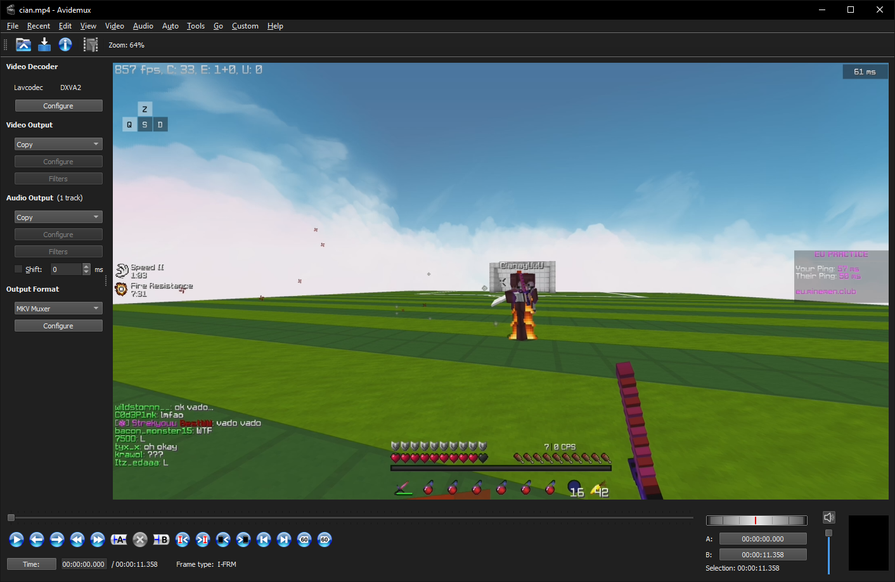

# Avidemux
<div class="grid cards" markdown>

-   [{align=right}](https://commons.wikimedia.org/wiki/File:Avidemux-logo.png)

    User interface for converting video files

    This program has lots of features but this page focuses on it's A/B cutting feature

    [:octicons-home-16: Homepage](https://avidemux.sourceforge.net){ .md-button }
    [:octicons-book-16:](https://sourceforge.net/p/avidemux/wiki/Home/){ .card-link title=Wiki}
    [:material-forum:](https://www.avidemux.org/admForum/){ .card-link title=Forums}
    [:octicons-code-16:](https://github.com/mean00/avidemux2){ .card-link title="Source Code" }

    === ":octicons-download-24:{ .green } Download"

        You can get builds on the sourceforge page:

        <https://avidemux.sourceforge.net/download.html>

    === ":custom-scoop: Scoop"
        `scoop install avidemux`{data-clipboard-text="scoop.cmd install main/avidemux"}
        |
        [`avidemux.json`](https://raw.githubusercontent.com/ScoopInstaller/Extras/master/bucket/avidemux.json)
    === ":custom-chocolatey: Chocolatey"
        `choco install avidemux -y`{data-clipboard-text="choco install avidemux -y"}
        |
        [package page](https://community.chocolatey.org/packages/avidemux)
    === ":simple-archlinux:{ .archblue } pacman"
        `sudo pacman -Sy avidemux-qt`{data-clipboard-text="sudo pacman -Sy avidemux-qt"}
        |
        [`arch package`](https://archlinux.org/packages/extra/x86_64/avidemux-qt/)

</div>


> See more screenshots [here](https://avidemux.sourceforge.net/screenshots.html)

<br>

## Features

Unlike LosslessCut it's very snappy but does not have as much cutting features.

It can be used like so:

1. Open the app
1. Drag in a video
1. Play back to where you wanna make the cuts
1. Press the <kbd>A</kbd> and <kbd>B</kbd> start/end time buttons
1. <kbd>CTRL+S</kbd> opens a file save dialog

## Video tutorial

tutorial by [skyler](https://twitter.com/skylerfrags) ([wallpaper](https://github.com/Atlas-OS/branding/blob/1fbcad1a8d474ba2c31b3b66528451c764585f32/wallpapers/16_9/v0.3/v2/Wallpapper%2016_9%20-%20v0.3%20v7.png))

<video width="688" height="387" controls="true" preload="auto">
    <source src="/assets/videos/video/ffmpeg/video-cutters/avidemux-tutorial.mp4">
</video>


## Custom keybindings

If you prefer using the <kbd>I</kbd> and <kbd>O</kbd> keys to set in and out points,

you can create named `settings.json` in the same directory that holds `avidemux.exe`(1)
{ .annotate }

1. search it up in your start menu, right click it -> open file location

=== ":octicons-file-code-16: `settings.json`"
    ```json
    "keyboard_shortcuts" : {
        "use_alternate_kbd_shortcuts" : true,
        "swap_up_down_keys" : false,
        "alt_mark_a" : "I",
        "alt_mark_b" : "O",
        "alt_reset_markers" : "R",
        "alt_goto_mark_a" : "A",
        "alt_goto_mark_b" : "B",
        "alt_begin" : "S",
        "alt_end" : "E",
        "alt_delete" : "Delete"
    }
    ```