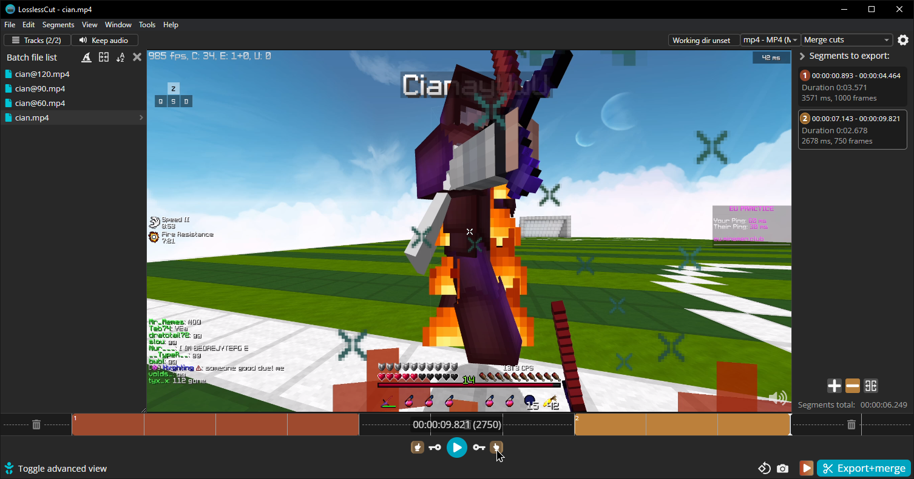

<div class="grid cards" markdown>

-   # :custom-losslesscut: LosslessCut

    electron-based user interface for cutting videos

    [:octicons-home-16: Homepage](https://mifi.no/losslesscut/){ .md-button }
    [:material-tag-text:](https://github.com/mifi/lossless-cut/releases/latest){ .card-link title="GitHub releases"}
    [:octicons-code-16:](https://github.com/mifi/lossless-cut/tree/HEAD){ .card-link title="Source Code" }
    [:material-heart:](https://mifi.no/thanks){ .card-link title="Support" }

    === ":simple-windowsxp:{.archblue} Windows"

        Mifi distributes Lossless-Cut as a portable 7-Zip archive

        [:custom-7z: Portable .7z archive](https://github.com/mifi/lossless-cut/releases/latest/download/LosslessCut-win-x64.7z)

        You can alternatively also get it for $20 from the Microsoft Store, sorry normies there's no installer.

        [:simple-microsoftstore: Microsoft Store](https://apps.microsoft.com/detail/9P30LSR4705L)

        Winget: See [microsoft/winget-pkgs#7204](https://github.com/microsoft/winget-pkgs/issues/72074)


    === ":custom-scoop: Scoop"

        ??? "You will need the "extras" bucket"

            If you've just installed [Scoop](https://scoop.sh), you'll need to execute the following in the cmd:

            ```PowerShell
            scoop.cmd update git 7zip
            scoop.cmd bucket add extras
            ```

        `scoop install losslesscut`{data-clipboard-text="scoop.cmd install extras/losslesscut"}
        |
        [`losslesscut.json`](https://raw.githubusercontent.com/ScoopInstaller/Extras/master/bucket/losslesscut.json)

    === ":custom-chocolatey: Chocolatey"

        `choco install losslesscut `{data-clipboard-text="choco install lossless-cut -y"}
        |
        [package page](https://community.chocolatey.org/packages/losslesscut)

    === ":simple-archlinux:{ .archblue } pacman"

        * [Snapcraft](https://snapcraft.io/losslesscut): `losslesscut`

        * [Flathub](https://flathub.org/apps/no.mifi.losslesscut): `no.mifi.losslesscut`

        AUR:

        * [`losslesscut-bin`](https://aur.archlinux.org/packages/losslesscut-bin)

        * [`losslesscut-git`](https://aur.archlinux.org/packages/losslesscut-git)


</div>



It has the following notable features:

* Upon dragging multiple files you can select a "batch mode" which lets you run through multiple video files at once
* Smart-cutting (experimental) lets you have frame-accurate cuts by only re-encoding the two outer edge keyframes
* It supports Send To / dragging multiple files on a shortcut to it
* You can select a different output codec
* You can chose to export as an audio-only / video-only file
* Cuts can be joined in one output video or split into multiple ones

## :material-export: Export page


If you mind the long filenames it gives to your export, you can click on the output filename (underlined in blue) and set it to this:
```
${FILENAME}-cut${EXT}
```
Though note if you make multiple exports you'll have a file conflict, you see fit.
