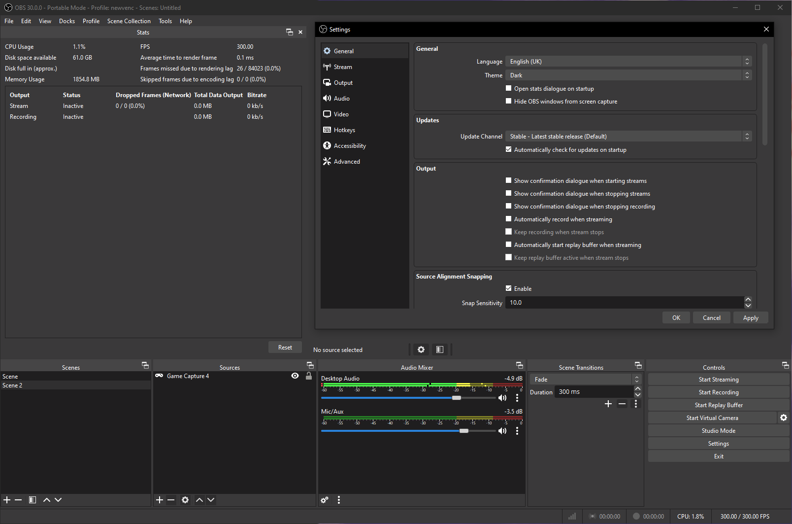
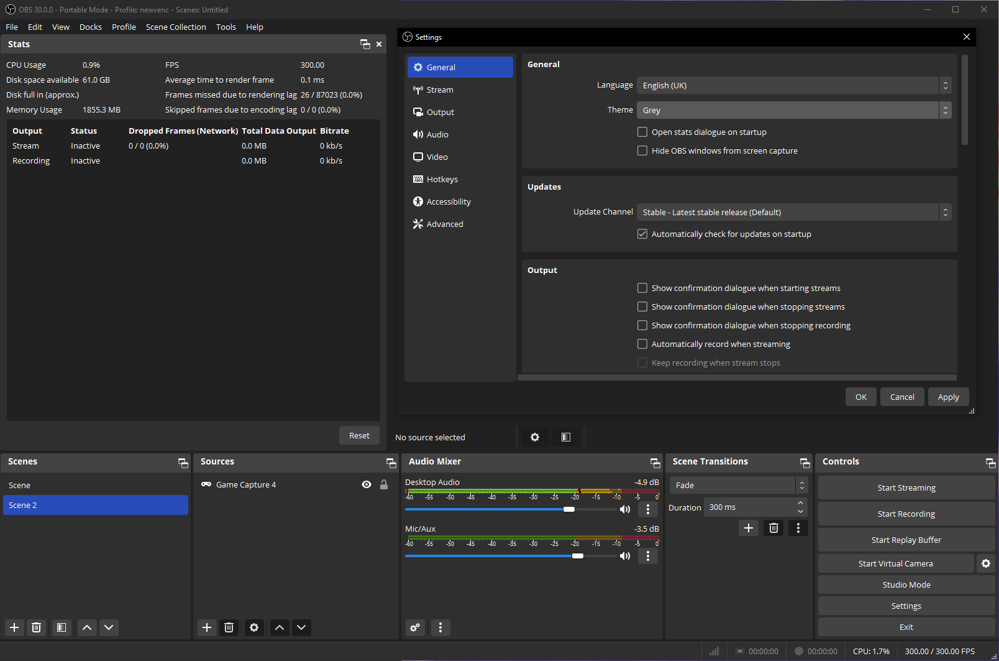

Running OBS as admin can help with Game Capture performance and compatibility, and is generally recommended in the community, to run it as admin in a single click instead of having to right click -> right click obs 64bit -> run as administrator, follow this simple guide:

<video controls><source src="/assets/videos/video/obs/RunShortCutAsAdmin.mp4" type="video/mp4"></video>

## Themes

=== "Yami (OBS 29+ default)"

    

=== "Dark (old default, most known)"

    

=== "Grey"

    

=== "System (Windows)"

    
