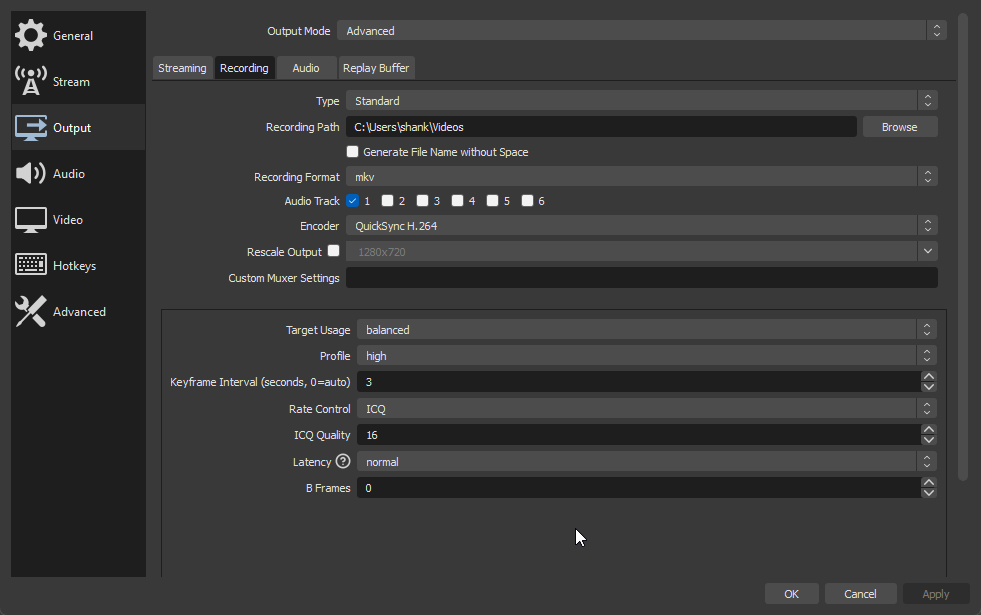

# :obs-output: Output

You're recommended to use the [latest](https://github.com/obsproject/obs-studio/releases/latest) version of OBS(1), check by clicking <kbd>Help</kbd> in the window title bar -> <kbd>Check For Updates</kbd>
{ .annotate}

1. #### Why?
:   Because there are no benefits to stay on an older version (e.g 25.8.0) of OBS anymore (except if you need compatibility with specific things like old plugins)

    * High fps recording with multi-track audio got fixed
    * Rumours of duplicated frames with high FPS recording in newer-than-25.0.8 versions have never resurged
    * There's a bunch of new encoding settings that let you have better efficiency or performance.

    If you do have a reason to keep using an old version that hasn't been mentioned (except laziness or procrastination), [let me know](../../contact.md) 

=== ":material-record-circle-outline: Recording"

    ##### Recording Settings

    `Recording format`: Fragmented MP4 (.mp4)

    I highly recommend switching from the default to the fragmented MP4, as it brings the advantages of recording in mkv whilst not having to remux mkv to mp4 for compatibility.

    * In general, NVENC is faster than AMF, which is faster than QuickSync, which is faster than x264/5

    Regarding `CQP`, `CFR` rate controls: It's inverted compared to CBR, 0 is lossless and 51 is most compressed


    ##### Video Encoder Settings

    === ":simple-nvidia: (NVIDIA) NVENC"

        !!! abstract "High FPS recording configuration"

            If you want to record in 120+FPS you're advised to configure the following:

            * <div class="annotate" markdown>`Preset`: P1 - P4(1)</div>

                1. OBS describes low Presets as "Lower Quality" in the context of <u>streaming with CBR in bandwith-limited scenarios</u>, if used for recording it'll be much more performant to record at the cost of bigger filesizes.

            * `Multipass Mode`: Single pass

        * `Rate Control`: <kbd>CQP</kbd>

        :   Much more adaptative than CBR which will always spits out the same constant bitrate, unlike CQP which write way less data when 

        * `CQ Level`: <kbd>18</kbd>

        * `Preset`: <kbd>P7: Slowest (Best Quality)</kbd>

        * `Multipass Mode`: <kbd>Two Passes (Full Resolution)</kbd>

        :   These two settings considerably affect the encoding speed and efficiency, they've been recently introduced to OBS and I'm not that knowledgeable regarding them.
        

    === ":custom-amd: (AMD) AMF"

        * `Encoder`: <kbd>AMD AMF H.265</kbd>

        * `Rate control`: <kbd>CQP</kbd>

        * `Keyframe interval`: <kbd>2</kbd>

        :	Set this to 2 if you're not planning on recording in high FPS

        * `Rate value`: <kbd>16-20</kbd> (depends on game)

        * `Quality preset`: <kbd>Quality</kbd>

        * `CQ Level`: <kbd>20</kbd>
        
        Note: there is also some documentation on the OBS Studio's GitHub wiki:

        <https://github.com/obsproject/obs-studio/wiki/AMF-HW-Encoder-Options-And-Information>
        <https://github.com/obsproject/obs-studio/wiki/AMF-Options>

    === ":custom-intel: (Intel) QSV"

        These settings are intended for recording Minecraft at 30FPS to 60FPS on Intel chips from 2020 and older, however with newer Iris XE and Arc iGPUs, you can record at 120FPS with these settings.

        * `Target Usage`: <kbd>TU7</kbd>

        :   In the OBS 30 update there were various quality profiles introduced for QuickSync. TU7 is  the best performing out of all the presets, with some sacrifices to visual quality. If you are running your game on a dedicated GPU and recording with QuickSync, you can use TU4 for better quality.

        * `Profile`: <kbd>High</kbd>

        :   With OBS 30 keep it at High, it's the best performing with the most compatibility.

        * `Keyframe Interval`: <kbd>3</kbd>

        :   Leave to 0 (auto) for the best performance, doing this will set the keyframe interval to 3 on the latest OBS version... so 3 is the actual best keyframe interval for recording at 60fps

        * `Rate Control`: <kbd>ICQ</kbd>

        :   It's preferable to use ICQ for best efficiency, it will adapt the bitrate per frame.

        * `ICQ Quality`: <kbd>16 or 23 or 30</kbd>

        :   From a few benchmarks from multiple CTT members Ashank found that the best quality for the file size is 16. However if you want to record at a higher frame rate, playing more GPU bound games, or if you are encountering frame drops, increase the value to 23 or above. Values of 30 or so still look acceptable, but the quality is noticably worse. You may use [this video](https://youtu.be/2xJ8sLPC5Cg) as reference for what TU7 and ICQ 30 looks like. Going above 30 looks objectively *bad*, if you are seriously struggling with recording with QSV at 30 ICQ, you should consider using a capture card, as no amount of optimization can improve your frames further.

        * `Latency`<kbd>normal</kbd>

        :   Set this to normal, as you aren't streaming. This setting is useful for getting the delay as low as possible during live streams but since this is a recording, you will not be needing it to be set lower than normal.

        * `Max-B-frames`: <kbd>0</kbd>

        :   B-Frames are generally used as a compression method, which takes up a significant amount of CPU and GPU power when gaming. You may set this value to 3 for games with low motion (if you are using a dedicated GPU in tandem with QSV). However it is optimal to leave this at 0, as someone recording with QSV is likely to be using an iGPU which needs all the power it can get.

        ##### In OBS

        [](../../assets/images/video/obs/output/recording/quicksync-ashank.png)

=== ":obs-stream: Streaming"

    The norm for streaming today is to use CBR rate control, which sends a set amount of data per second.
    
    Your encoder's speed preset will determine how well compressed your X Kbps will look.

    See their documentation regarding which bitrate you should use at what resolution:

    * :simple-youtube: <https://support.google.com/youtube/answer/2853702>
    * :simple-twitch: <https://help.twitch.tv/s/article/broadcasting-guidelines>
    * :simple-kick: <https://help.kick.com/en/articles/7066931-how-to-stream-on-kick-com>

    You can measure your upload speed on [speedtest.net](https://www.speedtest.net/) or [librespeed.org](https://librespeed.org/), and your stability with [Waveform's bufferbloat test](https://www.waveform.com/tools/bufferbloat)

    === ":simple-nvidia: (NVIDIA) NVENC"


        !!! danger "This section lacks settings"

            If you have experience regarding streaming with NVENC please contribute regarding this

        * `Rate Control`: <kbd>CBR</kbd>

        * `Bitrate`: Depends on platform and upload bandwith

        :   See links above

        * `Preset`: <kbd>P7: Slowest (Best Quality)</kbd>

        :   That'll provide the most efficient encoding for the given bandwith

        * `Multipass Mode`: <kbd>Two Passes (Full Resolution)</kbd>

        :   These two settings considerably affect the encoding speed and efficiency, they've been recently introduced to OBS and I'm not that knowledgeable regarding them.

        <iframe width="688" height="387" src="https://www.youtube.com/embed/uAqLJ3sxudU?color=white" frameborder=0 allowfullscreen></iframe>

    === ":custom-amd: (AMD) AMF"
    
        [I](../../contact.md#couleur) do not own an AMD, try copying the settings shown in this video and see how htey turn out:

        Feel free to [contribute](../../contributing.md) knowledge regarding this.

        <iframe width="688" height="387" src="https://www.youtube.com/embed/DXL8_Adbob4?start=329&color=white" frameborder=0 allowfullscreen></iframe>

        The settings seen in the video:
        ```
        MaxNumRefFrames=4 BReferenceEnable=1 BPicturesPattern=1 MaxConsecutiveBPictures=1 HighMotionQualityBoostEnable=1
        ```

        Note: there is also some documentation on their GitHub wiki:

        <https://github.com/obsproject/obs-studio/wiki/AMF-HW-Encoder-Options-And-Information>
        <https://github.com/obsproject/obs-studio/wiki/AMF-Options>


    === ":custom-intel: (Intel) QSV"

        Do you know good settings for streaming? [Let us know](../../contact.md)!

        I'd just recommend copying the settings from the recording tab with quality presets and CBR rate control

=== ":simple-buffer: Replay buffer"

    ##### Description

    Similar to [NVIDIA Shadowplay](https://www.nvidia.com/en-us/geforce/geforce-experience/shadowplay/), this captures using your recording settings and keeps in RAM only the last <kbd>X</kbd> seconds of what was captured and at any point you can press a hotkey to save it as a video file.

    It's an alternative to scrub through hour long recordings / stream VODs looking for important parts, each save will be separated per video file.

    ##### Replay Buffer Settings

    :fontawesome-regular-square-check: Enable Replay Buffer

    :   This will grant you the <kbd>Start Replay Buffer</kbd> button in your Controls dock

    * <kbd>Maximum Replay Time</kbd>: up to you

    : This is the amount of seconds you want to save each time, it's labelled "Maximum" because if you start the replay buffer and hit Save Replay hotkey before enough time elapses, it won't be X seconds long.

    *   <kbd>Maximum Memory</kbd>: depends on multiple factors

    :   This entirely depends on how large the filesize of your clips are gonna be, the biggest one I saved was 1.15GB, so I keep it at 2048MB.

### H.264 (AVC), H.265 (HEVC) or AV1?

See the [codec guide](../codecguide.md#hwenc)