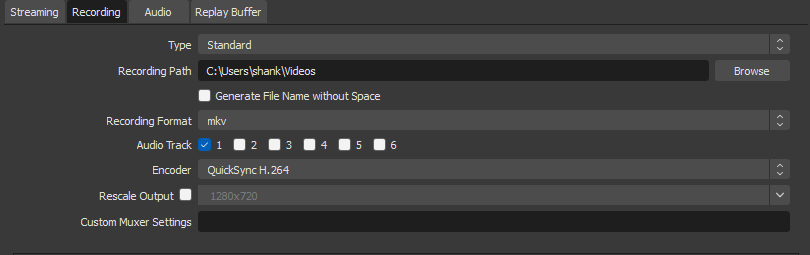
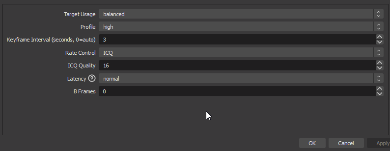

# :simple-intel: QuickSync OBS Configuration

Before following this, make sure that you've followed the [initial configuration](index.md) first. **Make sure that you test your settings!** See [Replay Buffer](index.md#replay-buffer).

## :material-cog: Configuration
:material-information-slab-circle: These settings are intended for recording Minecraft at 30-60 frames per second with acceptable quality and medium file sizes. If you're looking to record with high fps, look to [NVENC](#index.md#nvenc) as an alternative to QuickSync

=== ":material-speedometer: Maximum Performance"

    ??? image "Recording Settings"
        

            { width="600" }
        

    ??? image "Encoder Settings"
        

            { width="600" }
        

    <h3>Recording Settings</h3>

    - **Video Encoder:** Use **Quicksync H.264**. 

    <h3>Encoder Settings</h3>

    - **Target Usage** There is no visual difference between speed, balanced and quality as far as Shanki can tell.

    - **Profile** Keep at high or baseline, there is no measurable performance difference between them in Shanki's testing on both Minecraft Bedrock (1.16.100-1.17.34) and Java editions (1.7.10)

    - **Keyframe Interval** Leave to 0 (auto) for the best performance, doing this will set the keyframe interval to 3 on the latest OBS version... so 3 is the actual best keyframe interval for recording at 60fps

    - **Rate Control** Opposed to using CQP(6), It's preferable to use ICQ for best efficiency, as it will adapt the bitrate per frame.

    - **ICQ Quality** Forget about size in bytes, quality ranges from 1 (practically lossless, huge file), to 30 (very lossy, small), the higher you go, the smaller the file. From Shanki's Testing he found that the sweet spot is around 14-16 depending on how much RAM and what your laptop's power throttling limit is (to achieve the same visual acuity as NVENC). 

    - **Latency** Set this to normal, as you aren't streaming. This setting is useful for getting the delay as low as possible during live streams but since this is a recording, you will not be needing it to be set lower than normal.

    - **Max-B-frames** Leave Max-B-frames to 0 in this context

<!-- some things are duplicated as seemingly you can't use an annotation twice -->

1. **:material-account-question: Why this preset?**  
Despite the name it doesn't affect your video quality. Our testing showed that "P1: Fastest (Lowest Quality)" results in the least encoding lag, but produces a bigger filesize. While "P7: Slowest (Best Quality)" significantly reduces the FPS you can record at, but results in a smaller filesize.

2. **:material-account-question: Why this profile?**  
Using "high" profile on newer GPUs may limit the fps you can record at, but it effectively reduces the file size. This won't affect your video quality.

3. **:material-account-question: Why CQP over CBR and VBR?**  
It adjusts the bitrate for **each individual frame**, resulting in better video quality. Compared to CBR which uses a fixed bitrate, and VBR which varies the bitrate based on the complexity of the video, CQP can provide more efficient file size management.

4. **:material-account-question: Why these particular values?**  
The CQ Level ranges from **1** (lossless, resulting in huge files) to **30** (very lossy, resulting in small files).  

    !!! example ""
        <h4>[:material-arrow-right: Click here to see the Quality vs CQP Level Graph](../../assets/images/video/obs/nvenc/quality_vs_cqp.png)</h4>

5. **:material-account-question: Why should you use H.264?**  
HEVC is more efficient but harder to encode, leading to worse performance. The same applies to AV1 on the RTX 40 series GPUs.

6. **:material-account-question: Why CQP over CBR and VBR?**  
It adjusts the bitrate for **each individual frame**, resulting in better video quality. Compared to CBR which uses a fixed bitrate, and VBR which varies the bitrate based on the complexity of the video, CQP can provide more efficient file size management.

7. **:material-account-question: Why these particular values?**  
The CQ Level ranges from **1** (lossless, resulting in huge files) to **30** (very lossy, resulting in small files).  

    !!! example ""
        <h4>[:material-arrow-right: Click here to see the Quality vs CQP Level Graph](../../assets/images/video/obs/nvenc/quality_vs_cqp.png)</h4>

8. **:material-account-question: Why this profile?**  
On newer GPUs, "baseline" may reduce encoding lag when recording at high FPS at the cost of the bigger file size. This won't affect your video quality.

9. **:material-account-question: Why this preset?**  
Despite the name it doesn't affect your video quality. Our testing showed that "P1: Fastest (Lowest Quality)" results in the least encoding lag, but produces a bigger filesize. While "P7: Slowest (Best Quality)" significantly reduces the FPS you can record at, but results in a smaller filesize.

