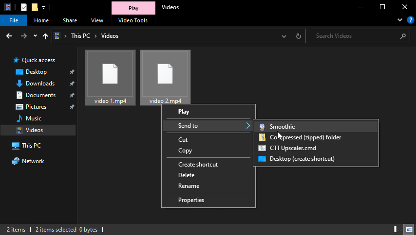
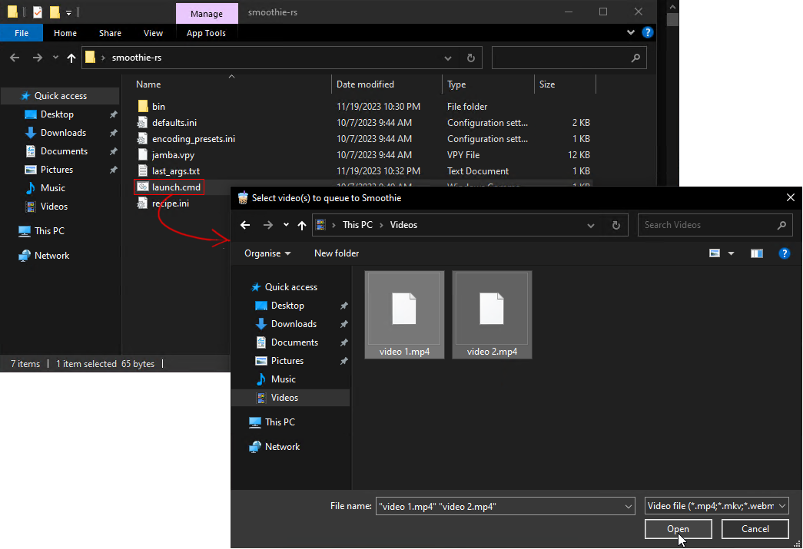

<h1 align="center">
    <!-- yup if i put a line break they're not actually centered =( -->
     Smoothie
</h1>
<p align="center">
    add motion blur to videos, with granular configuration
    <br>
    <br>
</p>
<p align="center">
    <a href="https://discord.com/channels/774315187183288411/1051234238835474502">
        
    </a>
    <a href="https://www.youtube.com/playlist?list=PLrsLsEZL_o4M_yTqZGwN5cM5ZxJTqkWkZ">
        
    </a>
    <a href="https://github.com/couleur-tweak-tips/smoothie-rs/releases/latest/download/smoothie-rs-nightly.zip">
        
    </a>
    <a href="https://github.com/couleur-tweak-tips/TweakList/blob/master/LICENSE">
        
    </a>
</p>

---

# About

Cross-platform fork of [blur](https://github.com/f0e/blur), now [rewritten](https://github.com/couleur-tweak-tips/Smoothie#readme) in Rust.

Smoothie is specialized in applying motion blur on video-game footage, it's got features like [smart-resampling](./recipe.md#frame-blending) and [RSMB](./recipe.md#flowblur).

you can configure it extensively within [`recipe.ini`](./recipe.md).

## Pros

* Magnitudes faster rendering than VEGAS Pro's smart resample


    * `Smoothie-RS`: 10.9 seconds
    * `VEGAS Pro 18.0 (build 284)`: 81 seconds
    * `FFmpeg tmix`: 19 seconds

    ??? info "Benchmark details"
        Frame blending a 1280x720, 990fps clip to 60fps (17 weights)

        Try it yourself with the [raw clip](https://big.fileditchnew.ch/b2/ZULNQGYkZJsjUDZLITEL.mp4)

        They were encoded with the UTVideo codec

        Here's the relevant values I've set in the recipe:
        ```ini
        [frame blending]
        enabled: yes
        fps: 60
        intensity: 1.0
        weighting: vegas

        [output]
        enc args: -c:v utvideo
        container: .MKV
        ```

        FFmpeg arguments:
        ```
        -i grzy.mp4 -vf tmix=frames=17 -y -r 60 -c:v utvideo tmikx.mkv
        ```

* Black-and-white-image based artifact masking for frame interpolation & flowblur artifacts { width="350" }

## Cons

* Another step in your workflow

## :material-file-eye: Usage

You can configure your recipe by modifying `recipe.ini`, all settings are explained [here](./recipe.md)

It does not have an interface as it is a [CLI tool](https://en.wikipedia.org/wiki/Command-line_interface) but there are tons of wrappers so you never have to open a terminal and type anything yourself:

1. You can feed your videos directly via [SendTo](../sendto.md) { width="450" }

2. Or select your videos in a file picker dialog by running [`Launch.cmd`](https://github.com/couleur-tweak-tips/smoothie-rs/blob/5bedf4ff231fd56832deacf4e32c5eb9f640c004/.github/workflows/shipper.ps1#L22) 

