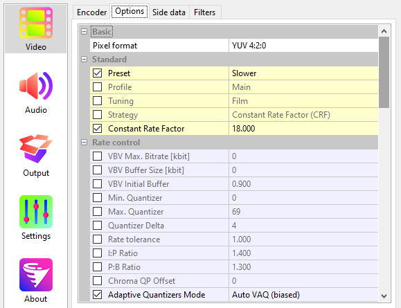
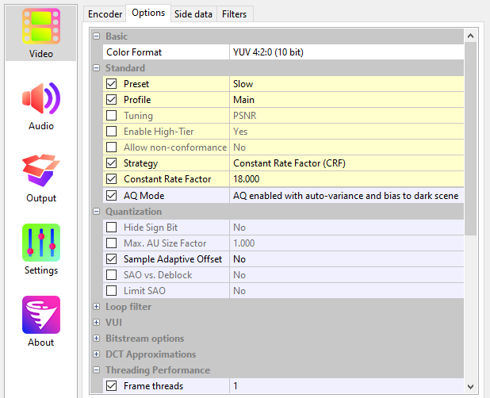
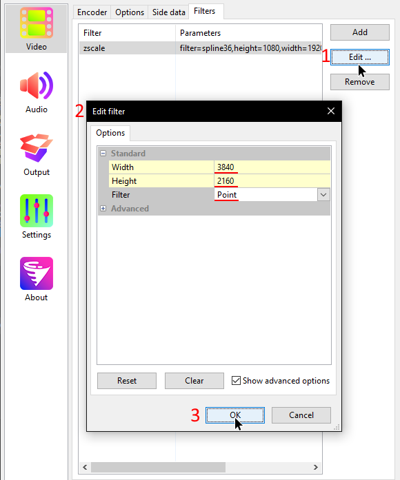

# Configuring Voukoder

The following relevant encoders are available on Voukoder:

### Compression-based codecs

* H.264 (AVC) & H.265 (HEVC)
    * for CPU (software x26*)
    * NVENC (NVIDIA)
    * AMF (AMD)
    * QuickSync (Intel)
* VP9
* AV1
    * for CPU (SVT-AV1)
    * NVENC (NVIDIA)

There might be other hardware accelerated encoders, feel free to add thme.

### Lossless codecs

They don't need much configuration, simply select in the Video pane -> Encoder tab them and save.

* UTVideo (recommended)
* ProRes

=== "H.264 (NVENC)"
    
=== "HEVC (NVENC)"
    ![]../..(/assets/images/video/voukoder/h265-nvenc.png)
=== "H.264 (x264)"
    
=== "HEVC (x265)"
    

# Upscaling
You can upscale and encode at the same time with Voukoder using the `zscale` filter

