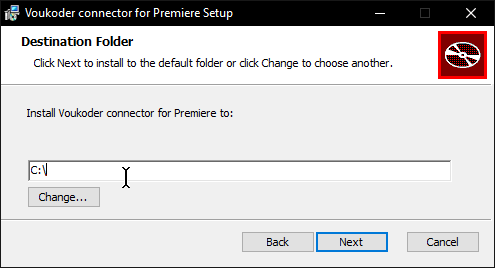

# What is Voukoder?

Voukoder is a <u>plugin for video editors</u> to adds support for various modern encoders & ffmpeg post processing filters (notably for [Upscaling](../ffmpeg/upscaling.md))


The currently documented Voukoder plugins on [ctt.cx](#) are:

* :custom-vegas-18: VEGAS Pro
* :custom-premiere-pro-og: Adobe Premiere Pro
* :custom-after-effects-og: Adobe After Effects
* <div class="annotate" markdown>:custom-resolve: DaVinci Resolve <u>Studio(1)</u></div>

    1. DaVinci Resolve Studio is required <br><br> <u>The free version does not support plugins!</u>

# Installation

I have made a PowerShell script which automates the following:

* Install and/or updates Voukoder Core
* Scans for open video editors to install a connector to
* Prompts you with a list of export templates to import

=== ":custom-pwsh2: Automatic"

    Open PowerShell and paste in the following command


    ```PowerShell
    iex(irm tl.ctt.cx);Install-Voukoder
    ```

    [The script](https://github.com/couleur-tweak-tips/TweakList/blob/master/modules/Installers/Install-Voukoder.ps1) goes through the following steps:

    1. Scan for an active Voukoder Core installation
        * If it is not up to date / installed, download and run the latest installer passively
    2. Look for video editor process names
        * If there is no connector for it installed, download and run the latest installer with automatic connection
    3. Display a list of render templates to import

    <iframe width="688" height="387" src="https://www.youtube-nocookie.com/embed/BBp2PnmRHmk?color=white" frameborder=0 allowfullscreen></iframe>

=== "Manual"

    ## Installing the Core {#install-core}

    You must <u>first install the Voukoder Classic Core</u>, only after will you install a connector which acts as the NLE-specific plugin.

    See <https://www.voukoder.org/forum/thread/783> for download links

    ## Installing the Connector {#install-connector}

    If the connector fails to find your video editor, and simply proposes `C:\`

    then you MUST manually locate and indicate where to install it.


    


    === ":custom-vegas-18: VEGAS Pro"

        1. Search VEGAS up in your search menu and right click it -> `Open file location`
        

        2. You'll most likely end up in your start menu's program shortcuts, in that case right click the selected shortcut again and click `Open file location` again

        3. If it opens a folder containing `vegas..0.exe`, copy the folder path(1) and <u>paste this</u>
        { .annotate }

            1. If not come ask for support on [Discord](https://discord.gg/CTT)

            

    === ":custom-premiere-pro-og: Adobe Premiere Pro & :custom-after-effects-og: Adobe After Effects"

        Paste in the following folder path:

        ```
        C:\Program Files\Adobe\Common\Plug-ins\7.0\MediaCore\
        ```

        This folder path worked for me when it didn't propose it, if you know more about this please contribute.
