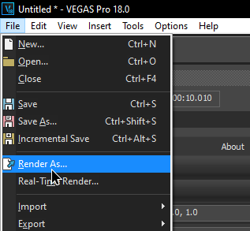
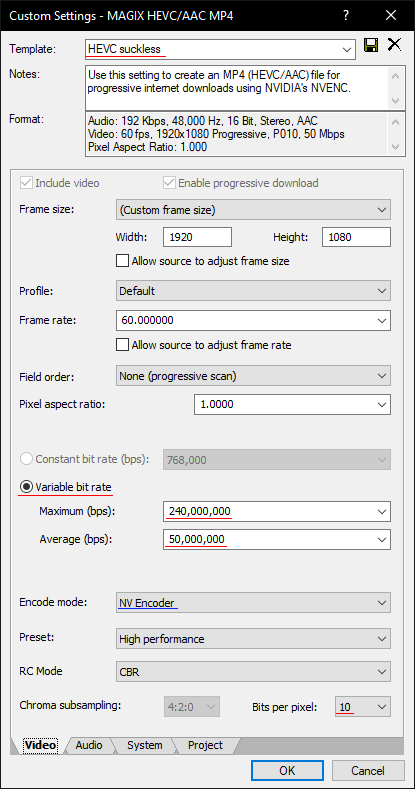

# VEGAS Pro

After finishing editing, go ahead and export your project by going in `File` -> `Render As...`

You'll be prompted with the Render Formats (left pane), each having their own codecs

=== ":package: MAGIX (H264|H265)/AAC MP4"

    Choosebetween H.264, H.265 and CPU/HW encoding by reading the [Codec guide](../codecguide.md)

    

    You can render in your project's native resolution and use the script from [Upscaling](../ffmpeg/upscaling.md)

    Or if set the scale to 3840x2160, do mind you won't have control over the scaling filter (iirc vegas uses bicubic which isn't that crisp)

    

=== ":custom-voukoder: Exporting with Voukoder"

    !!! bug "Set the desired output FPS Project properties"

        Voukoder behaves differently than MAGIX.
        
        It gets it's output resolution and frame rate from the <u>project properties</u>, NOT from the render template (notice how there's no text boxes asking you to select a resolution/fps anywhere)

        Tip: Press <kbd>CTRL+ENTER</kbd> to open VEGAS' project properties

    Voukoder differs by having everything in `Voukoder`, with all codecs nested in the <b>Voukoder dialog</b>

    If you installed the Core and right Connector, `Voukoder` should be available in the list of available formats

    Select `Video project default (4:2:0 8 bit), Audio: project default`, which is fine in 99% of edge cases.

    

    

    Click the `Show Voukoder dialog` button

    Learn how to configure it to your needs in [:octicons-gear-16: Configuration](./configuration.md),

    

Do not forget to customize the `Project` on the bottom tabs:

1. Set the video rendering quality to `Best`
1. Adjust color space and range if needed
1. Give it a name to easily use and remember it later
1. Hit the save icon on the top right

![]../../assets/images/video/voukoder/vegas-finishtemplate.png)
